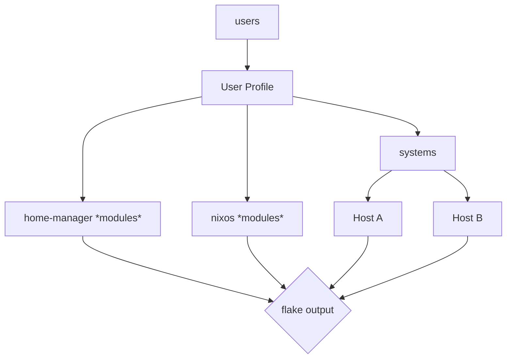

# dotfiles

A Nix-based dotfiles setup focused on clear abstraction boundaries between users, systems, and shared modules.

These dotfiles are primarily built for personal use, but structured so they’re understandable, reproducible, and extensible by others familiar with Nix.

**User Profiles**
 - [eureka-cpu]()
 - [andrewvious]()

**Conceptual flow:**
- **users**        → per-user configuration (home-manager)
- **systems**      → host-specific system definitions
- **nixos**        → shared system-level modules
- **flake output** → single entry point tying everything together
