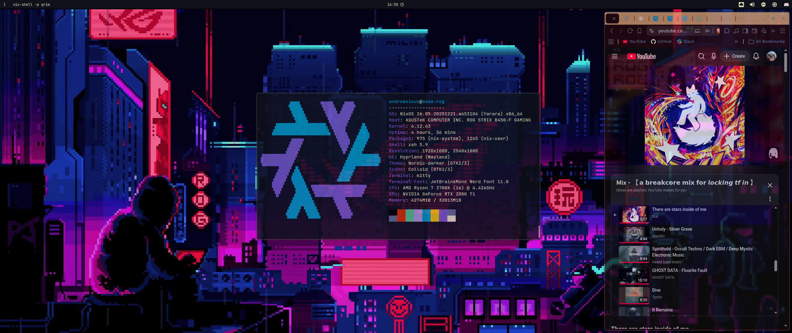

# andrewvious' dotfiles

A fork of `eureka-cpu`'s dotfiles that has been tuned for my systems, and eventually made its way to this repo.

I have these systems configured just how I like them, feel free to poke around:

 - Gnome ([dev-one] HP Dev One Notebook)
 - Hyprland ([asus-rog] ROG STRIX B450-F GAMING -- AMD Ryzen 7 3700X with NVIDIA GeForce RTX 2080 Ti BLACK EDITION)

My Hyprland system is highly configurable, and can be easily converted to new color schematics using the `./home-manager/colors.nix` module.

Here's how `asus-rog` looks with my wallpaper/colors/topbar:

